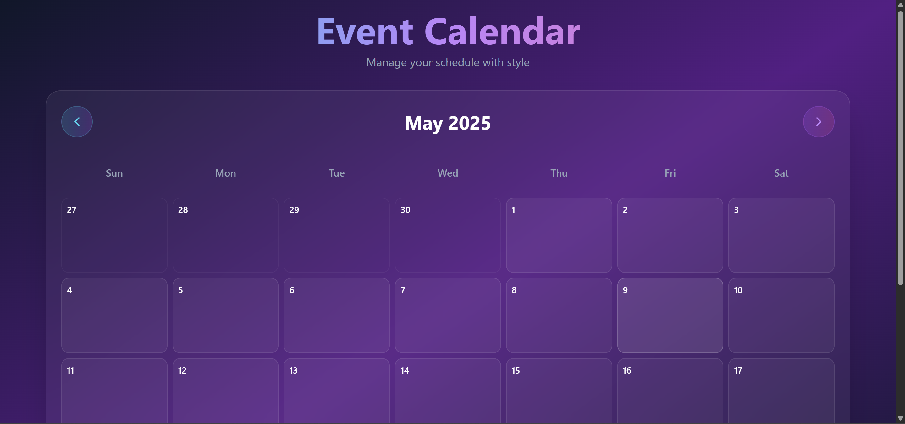
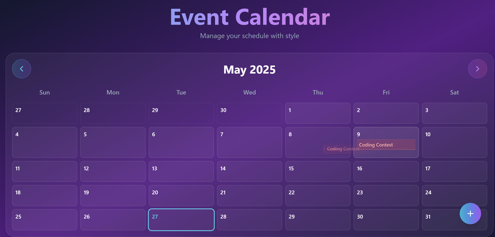
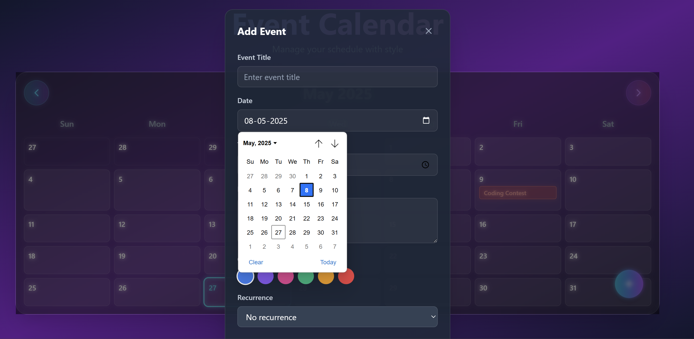
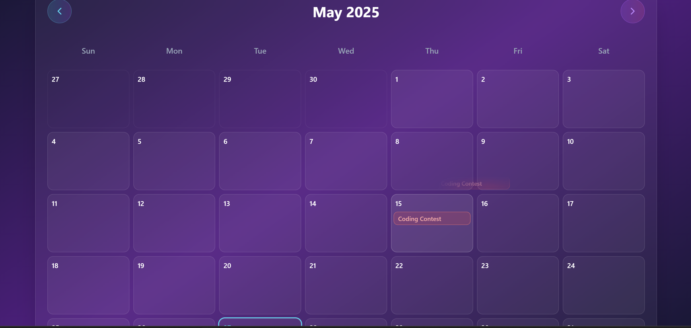

# 📅 EventCalendar

A simple and elegant web-based Event Calendar application to help users create, view, and manage events efficiently. This project is built using HTML, CSS, JavaScript, Typescript, React.

## 🌐 Live Demo

Check out the live version here: https://event-calendar-azure.vercel.app/

## 🚀 Features

* Add, edit, and delete events
* Monthly calendar view
* Clickable date cells to view events
* Responsive design for mobile and desktop
* Local storage
* Optional event reminders or recurrence support
* Drag and drop functionality with React DnD

## 📁 Project Structure

```bash
EventCalendar/
├── public/                     # Static assets (images, icons, etc.)
├── screenshots/                # Project screenshots for README or documentation
├── src/                        # Application source code
│   ├── components/             # Reusable UI components
│   │   ├── Calendar.tsx
│   │   ├── EventCard.tsx
│   │   ├── EventModal.tsx
│   ├── App.tsx                 # Main application component
│   ├── main.tsx                # Entry point for React and Vite
│   └── index.css               # Global styles and Tailwind imports
├── index.html                  # HTML template loaded by Vite
├── package.json                # Project metadata, dependencies, and scripts
├── tailwind.config.js          # Tailwind CSS configuration
├── tsconfig.json               # TypeScript compiler configuration
├── vite.config.ts              # Vite bundler configuration
└── README.md                   # Project documentation

```

## 🛠️ Installation

To run the project locally:

1. **Clone the repository**

```bash
git clone https://github.com/Chaithanyaina/EventCalendar.git
cd EventCalendar
```
1. **Install Dependencies and Run**
```bash
npm install
npm run dev
```


## 🖼️ Screenshots






## 📌 Future Improvements

* Integration with Google Calendar or Outlook
* Backend database (Firebase, MongoDB, etc.)
* Notification/reminder support
* User authentication

## 🤝 Contributing

Contributions are welcome! Please fork the repository and submit a pull request.

## 🙋‍♂️ Author

**Chaithanya Inaganti**
GitHub: @chaithanyaina
