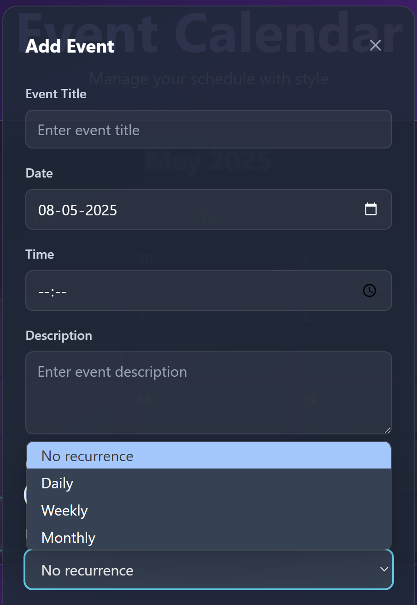

# 📅 EventCalendar

A simple and elegant web-based Event Calendar application to help users create, view, and manage events efficiently. This project is built using HTML, CSS, JavaScript, Typescript, React.

## 🚀 Features

* Add, edit, and delete events
* Monthly calendar view
* Clickable date cells to view events
* Responsive design for mobile and desktop
* Local storage
* Optional event reminders or recurrence support
* Drag and drop functionality with React DnD

## 📁 Project Structure

```bash
EventCalendar/
├── public/                 # Static assets
├── src/                   # Application source code
│   ├── components/        # Reusable components
│   ├── App.tsx           # Main App component
│   ├── main.tsx          # Entry point
│   └── index.css         # Global styles
├── screenshots/          # Project screenshots
├── index.html           # HTML template
├── package.json         # Project metadata and scripts
├── tailwind.config.js   # Tailwind configuration
├── tsconfig.json        # TypeScript configuration
├── vite.config.ts       # Vite configuration
└── README.md           # Project documentation
```

## 🛠️ Installation

To run the project locally:

1. **Clone the repository**

```bash
git clone https://github.com/Chaithanyaina/EventCalendar.git
cd EventCalendar
```
1. **Install Dependencies and Run**
```bash
npm install
npm run dev
```

## 🌐 Live Demo

Check out the live version here: https://Chaithanyaina.github.io/EventCalendar

## 🖼️ Screenshots

You can include screenshots like this:




## 📌 Future Improvements

* Integration with Google Calendar or Outlook
* Backend database (Firebase, MongoDB, etc.)
* Notification/reminder support
* User authentication

## 🤝 Contributing

Contributions are welcome! Please fork the repository and submit a pull request.

## 🙋‍♂️ Author

**Chaithanya Inaganti**
GitHub: @chaithanyaina
